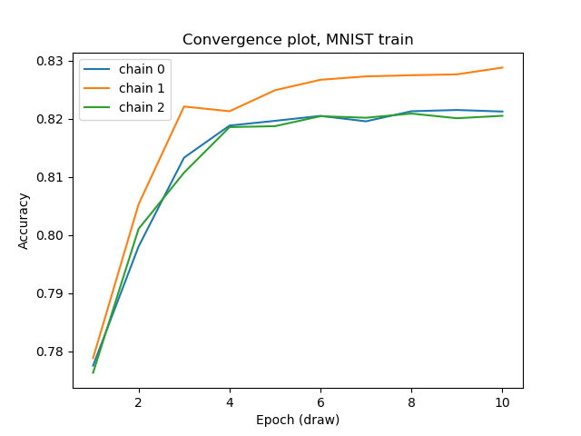

# MCMC simulation in R and Python

Here you'll find a _true MCMC_ simulation of drawing binary weights to fit binarized MNIST data, using one fully connected layer, followed by softmax. A _true MCMC_ simulation means using true (but slow) Bayesian optimization frameworks like PyMC3 and JAGS, not the approximation that you can find in the [main page](https://github.com/dizcza/MCMC_BinaryNet).

It's recommended to start with training on the truncated MNIST56 dataset. Another reason to do this is that [`mnist56_pymc.py`](mnist56_pymc.py) can be run in any Python, while the rest of the source code requires Python 3.6+.

## Datasets

| Dataset | Overview | Train/test images | Image size | Layer size | One MCMC draw duration |
| ------- | -------- | ----------------- | ---------- | --------------- | ---------------------- |
| MNIST   | Full [MNIST](http://yann.lecun.com/exdb/mnist) dataset | 60000/10000 | 28x28 | 784x10 | ~7 min |
| MNIST56 | A subset of MNIST dataset of digits 5 and 6 | 11339/1850 | resized to 5x5 | 25x2 | <1 sec |

## Convergence



As it can be seen, chains '_0_' and '_2_' are stuck in local minima while chain '_1_' continues exploring the binary weights space.

## Prerequisites

* PyMC3 (Python)

`conda install -c conda-forge pymc3 theano pandas`

* JAGS (R)

```
sudo add-apt-repository ppa:marutter/rrutter
sudo apt-get update
sudo apt-get install r-cran-rjags
```

Inside _R_ environment run `install.packages("rjags")`.
