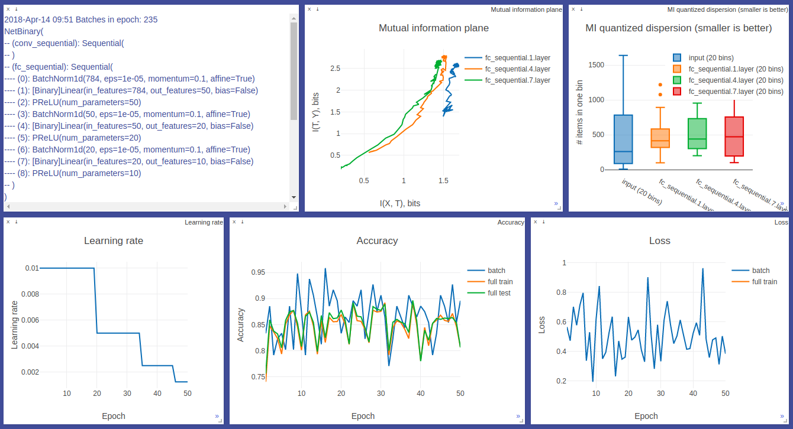

# MCMC Binary Net optimization

This repo shows an alternative optimization of binary neural nets that uses forward pass only. No backward passes. No gradients. Instead, we can use MCMC sampler to randomly select `flip_ratio` weights (connections) in any binary network and flip their signs (multiply by `-1`). Then, we can accept or reject a new candidate (new model weights) at MCMC step, based on the loss. Convergence is determined by the temperature as a function of `flip_ratio` that slowly decreases with time.

## Requirements

* Python 3.6+
* [requirements.txt](requirements.txt)


## Visualization



_A snapshot of training progress of fully connected 784 -> 50 -> 20 -> 10 binary network, trained by TrainerGradBinary on MNIST. Powered by [Visdom](https://github.com/facebookresearch/visdom)._


## Quick start

Before running any experiment, make sure you've started the visdom server:

`python3 -m visdom.server`

```python
import torch.nn as nn
from utils.layers import binarize_model
from trainer import TrainerMCMC

class MLP(nn.Module):
    def __init__(self):
        super().__init__()
        self.linear = nn.Linear(28**2, 10, bias=False)
    
    def forward(self, x):
        x = x.view(x.shape[0], -1)
        x = self.linear(x)
        return x

model = MLP()
model_binary = binarize_model(model)
print(model_binary)
# MLP(
#   (linear): [Binary]Linear(in_features=784, out_features=10, bias=False)
# )

trainer = TrainerMCMC(model_binary,
                      criterion=nn.CrossEntropyLoss(),
                      dataset_name="MNIST")
trainer.train(n_epoch=100)
# Training progress http://localhost:8097
```

## Results

* Train plots. Navigate to [http://ec2-34-227-113-244.compute-1.amazonaws.com:8099](http://ec2-18-234-90-227.compute-1.amazonaws.com:8097) and choose environments with `TrainerMCMC`.
* For your local results, go to [http://localhost:8097](http://localhost:8097)
* JAGS simulation in _R_: [paper](MCMC/paper.pdf), [source](MCMC/mnist56_jags.R)
* PyMC3 simulation in Python: [source](MCMC/mnist56_pymc.py)
