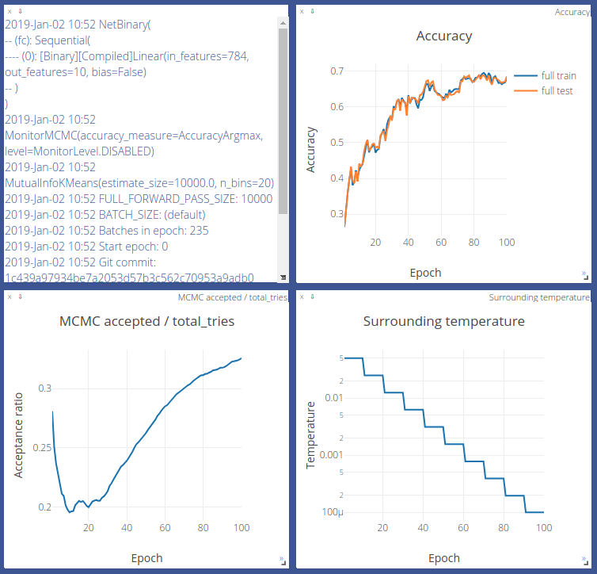

# MCMC Binary Net optimization

This repository demonstrates an alternative optimization of binary neural nets with forward pass in mind only. No backward passes. No gradients. Instead, we use Metropolis-Hasting sampler to randomly select 1 % of weights (connections) in a binary network and flip them (multiply by `-1`). Then, we can accept or reject a new candidate (new model weights) at MCMC step, based on the loss and the surrounding `temperature` (which defines how many weights to flip). Convergence is obtained by freezing the model (temperature goes to zero). Loss plays a role of model state energy, and you're free to choose any conventional loss you might like: Cross-Entropy loss, Contrastive loss, Triplet loss, etc.

## Requirements

* Python 3.6+
* [requirements.txt](requirements.txt)


## Quick start

Before running any experiment, make sure you've started the visdom server:

`python3 -m visdom.server`

```python
import torch.nn as nn
from utils.layers import binarize_model
from trainer import TrainerMCMCGibbs

class MLP(nn.Module):
    def __init__(self):
        super().__init__()
        self.linear = nn.Linear(28**2, 10, bias=False)
    
    def forward(self, x):
        x = x.view(x.shape[0], -1)
        x = self.linear(x)
        return x

model = MLP()
model_binary = binarize_model(model)
print(model_binary)
# MLP(
#   (linear): [Binary]Linear(in_features=784, out_features=10, bias=False)
# )

trainer = TrainerMCMCGibbs(model_binary,
                           criterion=nn.CrossEntropyLoss(),
                           dataset_name="MNIST")
trainer.train(n_epoch=100)
# Training progress http://localhost:8097
```

## Results

A snapshot of training binary MLP 784 -> 10 (binary weights and binary activations) with `TrainerMCMCGibbs` on MNIST:



More results:

* Navigate to [http://ec2-18-234-90-227.compute-1.amazonaws.com:8097](http://ec2-18-234-90-227.compute-1.amazonaws.com:8097).  Give your browser a few minutes to parse the json data. Choose environments with `TrainerMCMC`. 
* For your local results, go to [http://localhost:8097](http://localhost:8097)
* JAGS simulation in _R_: [paper](MCMC/paper.pdf), [source](MCMC/mnist56_jags.R)
* PyMC3 simulation in Python: [readme](MCMC/README.md)
